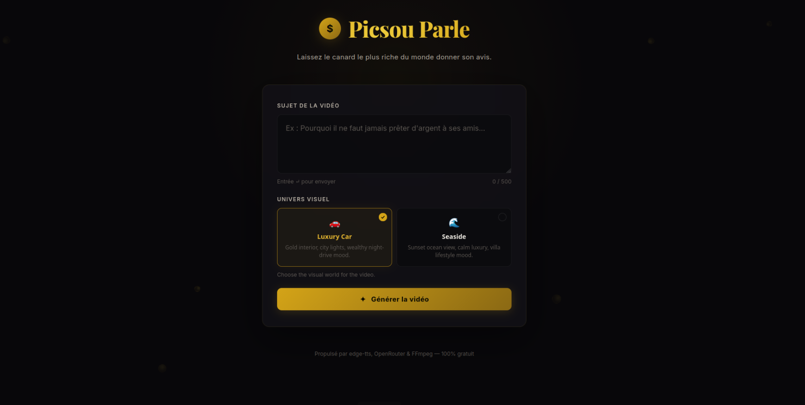
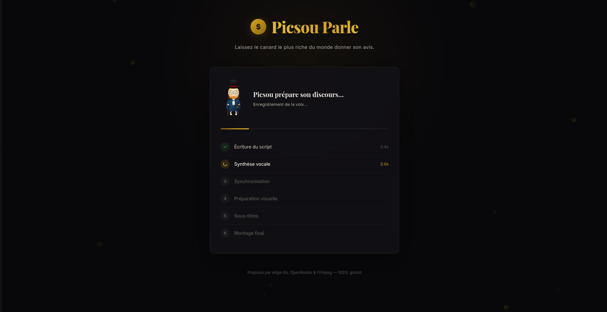
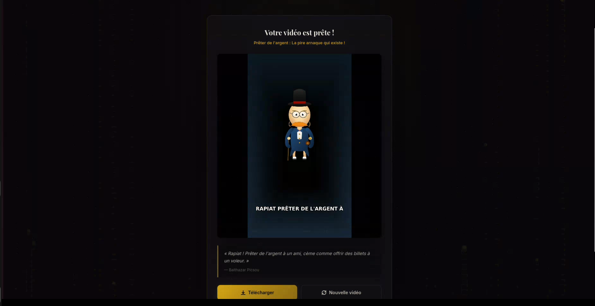

# Picsou Parle

> Turn any topic into a vertical short video starring the richest duck in the world — for **$0.00 per video**.

Picsou Parle is a fully automated prompt-to-video pipeline that generates French-language short videos (1080×1920, YouTube Shorts / TikTok / Reels format) featuring Uncle Scrooge delivering opinionated monologues on any subject.

Type a topic → get a finished MP4 with:
- AI-generated script in Picsou's voice
- Natural French TTS with word-level timing
- Animated character with lip-sync
- Dynamic highlighted subtitles
- Ken Burns background + optional music

---

## Demo

```bash
python -m backend.cli --prompt "Pourquoi il ne faut jamais prêter d'argent à ses amis"
```

Output: a ~20–40s vertical MP4 in `output/`.

### Screenshots

| Prompt | Generating | Result |
|:---:|:---:|:---:|
|  |  |  |

### Example output

**Prompt:** *"Explique pourquoi il ne faut jamais prêter de l'argent à ses amis, avec un ton sarcastique et cynique, comme si un milliardaire donnait un conseil brutal."*

📥 [Download the generated video](screenshots/generated-test/picsou_189d594409f8.mp4)

---

## Architecture

```
 Prompt
   │
   ▼
 ┌──────────────────┐
 │  generate_script  │  LLM (OpenRouter, free models) → structured JSON
 └────────┬─────────┘
          ▼
 ┌──────────────────┐
 │  generate_voice   │  edge-tts → MP3 + WordBoundary timestamps
 └────────┬─────────┘
          ▼
 ┌──────────────────────┐
 │  generate_timestamps  │  Validate & normalize word timing
 └────────┬─────────────┘
          ▼
 ┌──────────────────┐
 │  prepare_visuals  │  Gradient/AI background + character assets
 └────────┬─────────┘
          ▼
 ┌──────────────────┐
 │  build_subtitles  │  Group words → subtitle blocks (≤5 words, ≤2.5s)
 └────────┬─────────┘
          ▼
 ┌──────────────────┐
 │  compose_video    │  Frame-by-frame render → FFmpeg H.264/AAC MP4
 └──────────────────┘
```

Each step receives and returns a `PipelineContext` dataclass — no globals, fully resumable with `--from-step`.

---

## Features

| Feature | Details |
|---|---|
| **Script generation** | LLM via OpenRouter with 11-model fallback chain for free usage |
| **Voice synthesis** | edge-tts (Microsoft Neural TTS) — free, no API key |
| **Lip-sync animation** | Adaptive RMS threshold, open/closed mouth states at 30fps |
| **Dynamic subtitles** | Word-level highlight with auto line-wrapping |
| **Ken Burns effect** | Slow zoom on background over video duration |
| **AI backgrounds** | Optional FLUX.1 image generation via `--ai-background` |
| **Background music** | Auto-mixed at low volume from `assets/music/` |
| **Asset caching** | Backgrounds cached by mood in `assets/cache/` |
| **Web UI** | Glassmorphism dark theme with SSE real-time progress |
| **Resume pipeline** | `--from-step` to restart from any step using cached intermediates |
| **Auto-retry** | Exponential backoff + model fallback on rate limits |

---

## Prerequisites

- **Python** ≥ 3.10
- **FFmpeg** ≥ 4.x in PATH
- **OpenRouter API key** (free tier works)

```bash
# Ubuntu/Debian
sudo apt install -y ffmpeg

# Verify
ffmpeg -version
```

---

## Installation

```bash
git clone <repo-url> && cd picsou-parle

python -m venv .venv
source .venv/bin/activate
pip install -r requirements.txt
```

Create `.env` from the example:

```bash
cp .env.example .env
# Edit .env and add your OpenRouter key
```

### Environment variables

| Variable | Required | Default | Description |
|---|---|---|---|
| `OPENROUTER_API_KEY` | Yes | — | OpenRouter API key |
| `LLM_MODEL` | No | `google/gemma-4-26b-a4b-it:free` | Primary LLM model |
| `TTS_VOICE` | No | `fr-FR-HenriNeural` | edge-tts voice ID |
| `AI_BACKGROUND` | No | `false` | Generate backgrounds with AI |
| `IMAGE_MODEL` | No | `black-forest-labs/FLUX.1-schnell:free` | Image generation model |
| `VIDEO_FPS` | No | `30` | Output video framerate |
| `MUSIC_VOLUME` | No | `0.12` | Background music mix level |
| `KEEP_TEMP` | No | `false` | Keep intermediate files |

---

## Usage

### CLI

```bash
# Basic generation
python -m backend.cli --prompt "Les crypto-monnaies sont une arnaque"

# With AI background and verbose logging
python -m backend.cli --prompt "..." --ai-background --verbose

# Resume from a specific step (uses cached files in tmp/)
python -m backend.cli --prompt "..." --from-step compose_video --keep-temp

# Custom voice and model
python -m backend.cli --prompt "..." --voice fr-FR-HenriNeural --model google/gemma-4-26b-a4b-it:free
```

### Web UI

```bash
uvicorn backend.main:app --reload --host 0.0.0.0 --port 8000
```

Open **http://127.0.0.1:8000** (or `http://localhost:8000`) — the UI shows real-time progress with step-by-step tracking, animated character, and gold confetti on completion.

> **Note:** If `localhost` doesn't work, use `127.0.0.1` directly. Some Linux systems resolve `localhost` to IPv6 `::1` which may not match the server binding.

### API

| Method | Endpoint | Description |
|---|---|---|
| `POST` | `/api/generate` | Start generation (`{"prompt": "..."}`) |
| `GET` | `/api/runs/{id}/status` | Run status + script metadata |
| `GET` | `/api/runs/{id}/progress` | SSE stream of step updates |
| `GET` | `/api/runs/{id}/video` | Download finished MP4 |

---

## Project Structure

```
backend/
├── cli.py                          # CLI entry point
├── main.py                         # FastAPI server + SSE
├── config.py                       # pydantic-settings configuration
├── pipeline/
│   ├── orchestrator.py             # Step sequencing & run state
│   ├── context.py                  # PipelineContext dataclass
│   ├── models.py                   # Script, TimestampedWord, SubtitleGroup
│   └── steps/                      # One module per pipeline step
│       ├── generate_script.py
│       ├── generate_voice.py
│       ├── generate_timestamps.py
│       ├── prepare_visuals.py
│       ├── build_subtitles.py
│       └── compose_video.py
├── providers/
│   ├── llm.py                      # OpenRouter client + fallback chain
│   ├── tts.py                      # edge-tts wrapper
│   └── image.py                    # AI background generation
└── utils/
    ├── audio.py                    # RMS amplitude extraction
    ├── fonts.py                    # Font discovery
    ├── rendering.py                # Frame rendering (Ken Burns, subtitles)
    └── retry.py                    # Async retry with backoff

static/index.html                   # Web UI (single-file)
scripts/generate_character.py       # SVG→PNG character asset generator
prompts/picsou_script.txt           # System prompt for script generation
assets/
├── character/                      # Mouth open/closed PNGs
├── fonts/                          # Optional: Montserrat-Bold.ttf
├── backgrounds/                    # Optional: static backgrounds
├── cache/                          # Auto-cached backgrounds by mood
└── music/                          # Optional: background music file
tests/                              # 26 unit tests
output/                             # Generated MP4 files
tmp/                                # Intermediate pipeline files
```

---

## Character Assets

The character is rendered as SVG and rasterized to PNG via `cairosvg`:

```bash
python scripts/generate_character.py
# → assets/character/picsou_mouth_closed.png
# → assets/character/picsou_mouth_open.png
```

The SVG uses bezier curves, radial gradients, drop shadows, and detailed vector paths for a clean 2D cartoon look.

---

## Testing

```bash
# Unit tests (26 tests)
pytest tests/ -v

# Full end-to-end pipeline test
python test_pipeline.py
```

Tests cover: JSON parsing edge cases, subtitle grouping logic, audio threshold computation, and async retry behavior.

---

## Cost

| Component | Provider | Cost |
|---|---|---|
| Script | OpenRouter (free models) | $0.00 |
| Voice | edge-tts | $0.00 |
| Timestamps | edge-tts native | $0.00 |
| Background | Pillow gradient / FLUX.1 free | $0.00 |
| Composition | FFmpeg local | $0.00 |
| **Total** | | **$0.00 / video** |

---

## Troubleshooting

| Problem | Fix |
|---|---|
| `OPENROUTER_API_KEY is not set` | Add key to `.env` and restart |
| `ffmpeg: command not found` | Install FFmpeg: `sudo apt install ffmpeg` |
| No character in video | Check `assets/character/picsou_mouth_closed.png` exists |
| Subtitle font looks basic | Add `assets/fonts/Montserrat-Bold.ttf` |
| 429 rate limit errors | Automatic — falls back through 11 free models |
| Subtitles cut off | Handled — auto line-wrapping at 52px font size |
